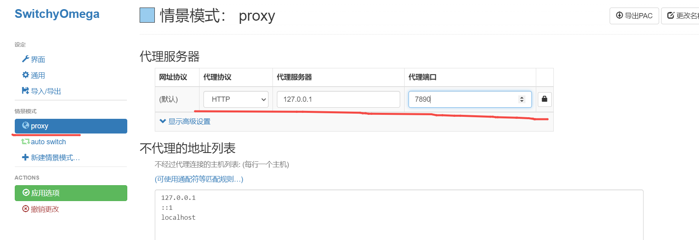

# clash

> [!NOTE] Title
>myproxy.zip 这个压缩文件包含clash客户端, 解压密码: clash

1. 打开以后exe文件后, 首页如下

	

2. 点击 Profiles, 导入订阅配置文件即可.

	
	
	
3. 打开system proxy

	
	
4. 打开 chrome 商店 https://chromewebstore.google.com/?utm_source=ext_app_menu, 搜索 switchyomega 如下图所示, 选择并点击

	

5. 点击 add to chrome

	
	

6. 点击添加扩展程序

	

7. 安装成功后进入配置界面, 配置proxy为本地的 127.0.0.1:7890 即可.

	
	
8. 在 chrome 地址栏访问google.com, 并将右边的代理切换至 proxy 即可.

	
	
	