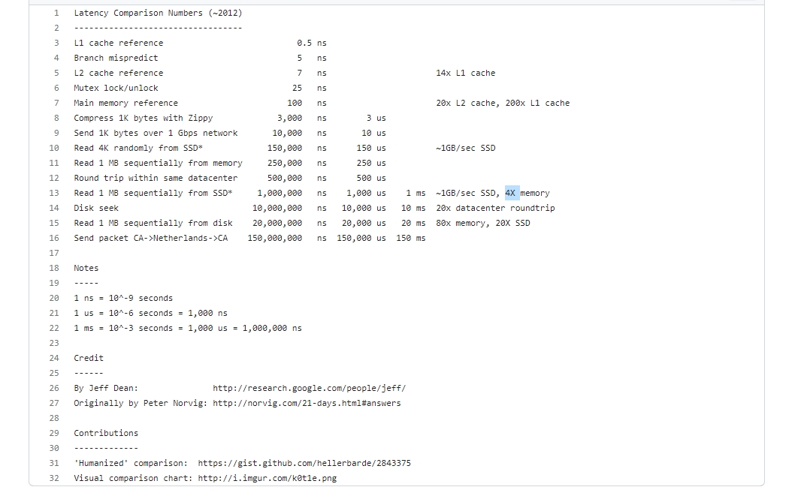

### c

#### devlop

c/c++/rust

> [!NOTE] kernel
> module
load
link
debug

- python extension  speed up
	- 加解密
	- 编解码
	- 推荐算法 faiss 矩阵的运算

- nginx  webserver 扩展
- postgresql extension
- redis extension

#### reverse

- 汇编
- 逆向
- 客户端的代码加固

### data structure

`leetcode`

- 链表
- 树
- 搜索
- 查找

#### network

#### performance

[how-do-i-make-and-use-my-own-c-library-in-vscode](https://stackoverflow.com/questions/77560681/how-do-i-make-and-use-my-own-c-library-in-vscode)

https://packages.msys2.org/package/

### 配置管理 python

[dynaconf](https://github.com/dynaconf/dynaconf)

[12factor-config](https://12factor.net/config)
[12factor](https://12factor.net/)
[distributed-configuration](https://github.com/topics/distributed-configuration)

### postgresql

根据pg内置的统计表获取 pipelinedb mrel 表的每秒新增和修改行数, 修改是否影响索引等信息. 查看关于 pg 的大数据量写的优化实践.

https://www.postgresql.org/docs/current/monitoring-stats.html#MONITORING-STATS-VIEWS-TABLE
https://www.postgresql.org/docs/current/pgstatstatements.html
http://www.postgres.cn/news/viewone/1/596
https://github.com/Vonng/pigsty
https://asciinema.org/a/603609
https://pigsty.io/zh/
https://pigsty.io/zh/docs/reference/extension/
https://pigsty.io/zh/docs/pgsql/extension/#%E6%89%A9%E5%B1%95%E5%88%97%E8%A1%A8
https://zhuanlan.zhihu.com/p/542047832
https://www.timescale.com/blog/select-the-most-recent-record-of-many-items-with-postgresql/

### vscode Configure C/C++ IntelliSense

https://code.visualstudio.com/docs/cpp/configure-intellisense#_option-3-edit-the-ccpppropertiesjson-file-directly

[vscode c-cpp-properties-schema-reference](https://code.visualstudio.com/docs/cpp/c-cpp-properties-schema-reference)