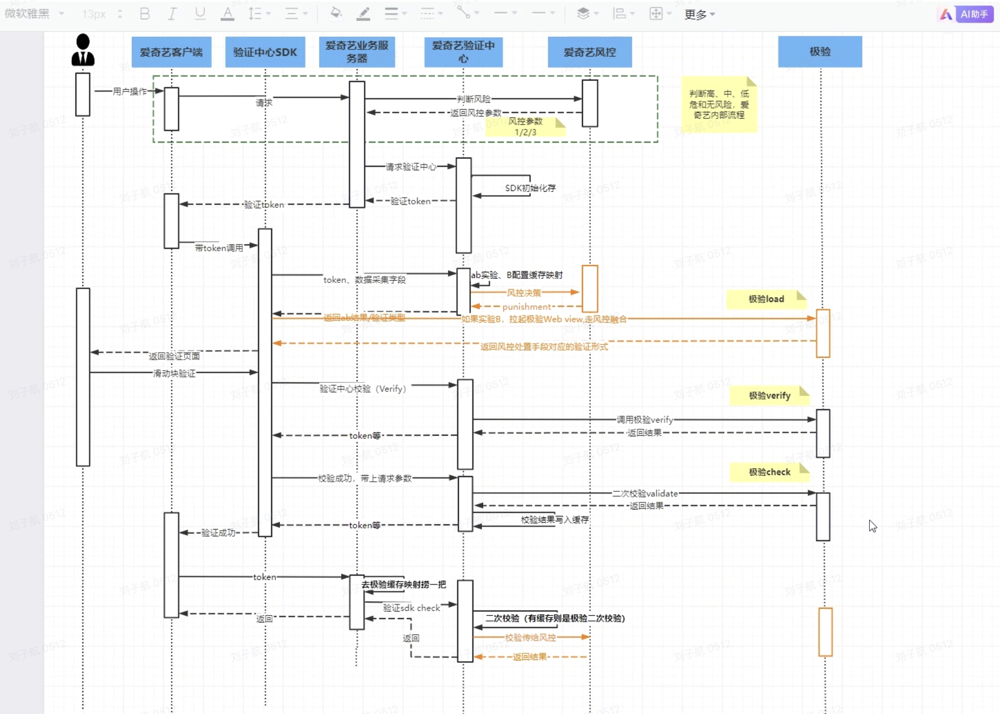

[You should learn Drizzle, the TypeScript SQL ORM](https://syntax.fm/show/721/you-should-learn-drizzle-the-typescript-sql-orm/transcript)  
### monorepo

[Python monorepo with uv and pex](https://chrismati.cz/posts/uv-pex-monorepo/)  
https://pedropark99.github.io/zig-book/Chapters/01-zig-weird.html  
[Better Auth + Drizzle: The Schema Gotcha That Breaks Everything](https://blog.aethostech.com.br/blog/2026-03-05-better-auth-drizzle-gotcha/)  
[Taking ML to production with Rust: a 25x speedup](https://lpalmieri.com/posts/2019-12-01-taking-ml-to-production-with-rust-a-25x-speedup/)  
### cdc

[DuckDB + Streaming CDC: Near-Real-Time Analytics from Append-Only Parquet](https://freedium-mirror.cfd/https://medium.com/@hjparmar1944/duckdb-streaming-cdc-near-real-time-analytics-from-append-only-parquet-95027f3f4af4)  

### Electric Sync

https://electric.ax/sync/

### 架构图

