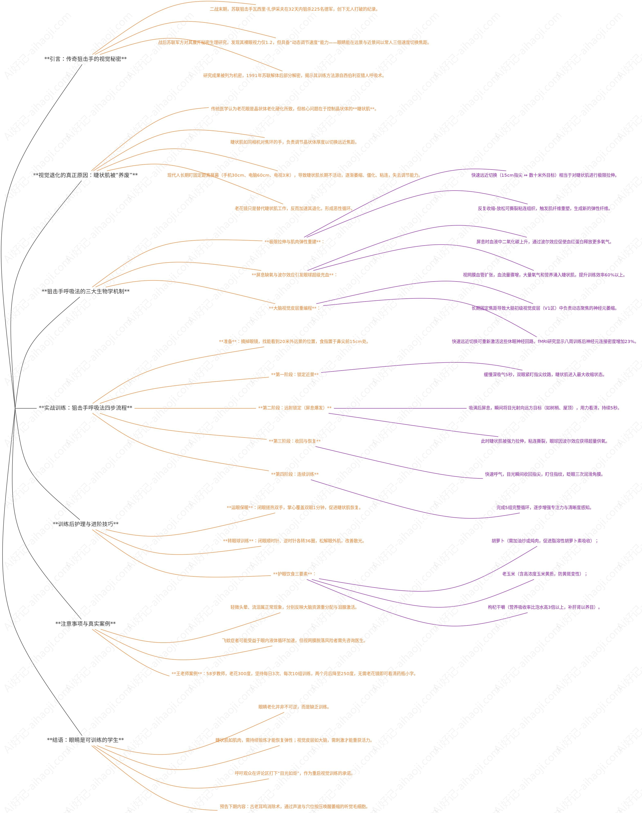

为了宝宝，我要恢复视力 护眼: 极力旋转 近远切换 掌温热敷 阳光激活 颈部通络


[55岁后视力还能恢复？神经学家：“狙击手呼吸法”，摘掉老花镜（亲测有效）](https://www.bilibili.com/video/BV1rFAjzMEJJ/?spm_id_from=333.1387.favlist.content.click&vd_source=8f2e8d9afb969c72b313832ed92dc193)  
### links


[Systems Programming with Zig](https://pan.baidu.com/pfile/docview?path=%2Fgeetest%E5%B7%A5%E4%BD%9C%2FSystems%20Programming%20with%20Zig%20Build%20Real%20Tools%20with%20No%20Hidden%20Cost%20(Mihalis%20Tsoukalos)%20(z-library.sk%2C%201lib.sk%2C%20z-lib.sk).pdf&fsid=959549845899604&size=8653537&view_from=personal_file&md5=a19be7735uf28df91421f31689f33991&share=0&client=web&scene=main)  
[Tree-sitter](https://tree-sitter.github.io/tree-sitter/using-parsers/)  

[You should learn Drizzle, the TypeScript SQL ORM](https://syntax.fm/show/721/you-should-learn-drizzle-the-typescript-sql-orm/transcript)  
**[better-api](https://github.com/ProMehedi/better-api)**  
[better auth tutorial demos with bun hono drizzle](https://www.google.com/search?q=better+auth+tutorial+demos+with+bun+hono+drizzle&sca_esv=fea2caa620225ab9&sxsrf=APpeQnshw9X8_2QveeMEOi6qaE-AQDE1DQ%3A1783928059350&ei=-5RUauT3FOHm2roPhPLSiQ4&biw=1933&bih=982&uact=5&sclient=gws-wiz-serp&udm=50&fbs=ABfTbFVyMZGZf1hfvX9uKjN_-G8cqu7ocb7U6ah0xpkIrGMK4LpKPoHZrc4HVz9uOAATjT2whS8aQNdsb1nn47m_ZQdHB9gC5QFbkMU5k-hNOkzSdtH4CZUBbfeXR09jNyERwWUhT_5NH3huoI5pAHOXdwF_iOVUkFiI7uC5ZQAcY75JAGb_d8LQz1IOzeAWrXUQch5pGvTnF-hejMajxsknjtWRY5PQKA&aep=10&ntc=1&mstk=AUtExfCqnEnK8hocbKBiZGTezpjZgFanaxDoNSbqml6t2k6XInZXYoGPVqeGo8XGzPAUyMyemvGmSU3DSFxaLdSPK2ln1srJxe7dAql-m_L7hMF_0Ss886julLoWmMHv0s_7gfPfTO6GNxsjFQA1_cln4-YkFFKblIqAWGTzhkdz9z33rblwa6OqdfCyevMh3_tMxt6DxOjrEPcJfIiUTbrybewVi1sCtku1f7JpGGOmJjGDnxfxtOY1H1xx_i80brnMbEFHnAAwL5S6jUC6vGqzWgxhXoHwGh_j8ak9SLtkkmjDKoG3iytgANnxlGkr_DRfUWqJv2-sgbuCXA&aioh=3&csuir=1&cs=0&mtid=LJZUatT1OZ-0vr0PosrRsAs)  
[Better Auth + Drizzle: The Schema Gotcha That Breaks Everything](https://blog.aethostech.com.br/blog/2026-03-05-better-auth-drizzle-gotcha/)  

[better-t-stack: Modern CLI for scaffolding end-to-end type-safe TypeScript projects](https://www.better-t-stack.dev/)  
[better-t-stack template](https://www.better-t-stack.dev/new?db=postgres&add=vite-plus)  

```bash
bun create better-t-stack@latest my-better-t-app --frontend tanstack-router --backend hono --runtime bun --api trpc --auth better-auth --payments none --database postgres --orm drizzle --db-setup docker --package-manager bun --git --web-deploy none --server-deploy none --install --addons vite-plus --examples ai todo
```

[风控策略的自动化生成-利用决策树分分钟生成上千条策略](https://mp.weixin.qq.com/s?__biz=MzA4OTAwMjY2Nw==&mid=2650187831&idx=1&sn=6d2c49c181aa173df08d6e70ad5f5ca2&chksm=88238ff3bf5406e5d70b96c854ae77ae1e00a3099bb1269bd315b8d4b1114ec0a03d746643c8&scene=21#wechat_redirect)  
[百亿美金的设计，深度剖析 GitLab 的 Postgres 数据库 schema](https://mp.weixin.qq.com/s/EDio9C1c-FbsEGozn66amw)  
[Zadig 基于 OPA 实现 RBAC 和 ABAC 权限管理技术方案详解](https://mp.weixin.qq.com/s?__biz=Mzg4NDY0NTMyNw==&mid=2247486794&idx=1&sn=d6f6684ca0748a63ea9fe2c89372b092&chksm=cfb441eaf8c3c8fc6ef525e45b539ea6652926efeb22e485d736ba71499edb829c26d2146922&scene=21&cur_album_id=2315471511341957121#wechat_redirect)  

[两种免费防御DDoS攻击的实战攻略，详细教程演示](https://www.bilibili.com/video/BV1d2kJYhEdK/?spm_id_from=333.1007.tianma.1-3-3.click&vd_source=8f2e8d9afb969c72b313832ed92dc193)  

[GitHub - Shopify/toxiproxy: A TCP proxy to simulate network and system conditions for chaos and resi](https://github.com/Shopify/toxiproxy) 用这个来模拟tcp层面的异常.  

[How to Configure the File Exporter in the OpenTelemetry Collector](https://oneuptime.com/blog/post/2026-02-06-file-exporter-opentelemetry-collector/view)  
[How to Configure HAProxy Stick Tables](https://oneuptime.com/blog/post/2026-01-27-haproxy-stick-tables/view)  
[How to Fix OpenTelemetry Python Logging Bridge Not Correlating Logs with Active Trace Context](https://oneuptime.com/blog/post/2026-02-06-fix-python-logging-bridge-trace-context/view#:~:text=On%20this%20page,Setting%20Up%20the%20Logging%20Bridge)  
[Understanding OpenTelemetry Logging](https://openobserve.ai/blog/understanding-opentelemetry-logs/)  

[Python library for RSA public decryption](https://stackoverflow.com/questions/68458019/python-library-for-rsa-public-decryption)  
[Journey migrating to uv workspace](https://dev.to/jimmyyeung/journey-migrating-to-uv-workspace-34a7)  
[Monorepo with Bun](https://dev.to/vikkio88/monorepo-with-bun-474n)  
[LogLayerUnifies Logging](https://loglayer.dev/)  

[ Syncing SQLite and Postgres?](https://www.youtube.com/watch?v=_U5Z8AQy0hc)  
### python 编译

```bash
ryefccd@fccd:~/python/Python-3.8.13$ ./configure --with-openssl=/opt/openssl/ CFLAGS="-I/opt/openssl/include -I/opt/sqlite3.33/include -L/opt/openssl/lib/ -L /opt/sqlite3.33/lib" LDFLAGS="-Wl,-rpath=/opt/openssl/lib/ -Wl,-rpath=/opt/sqlite3.33/lib"
```


ubuntu:
```bash
sudo apt install build-essential zlib1g-dev libncurses5-dev libgdbm-dev libnss3-dev libssl-dev libreadline-dev libffi-dev libsqlite3-dev wget libbz2-dev

# python3.8 openssl1.1.1 编译: 
# 先编译 openssl 到 /opt/openssl 到非默认系统搜索路径:
make distclean
sudo ./config -fPIC -shared --prefix=/opt/openssl -Wl,-rpath=/opt/openssl/lib
make -j4
sudo make altinstall
# 卸载 
sudo make uninstall

# 再编译python3.8:
./configure --with-openssl=/opt/openssl/ CFLAGS="-I/opt/openssl/include" LDFLAGS="-L/opt/openssl/lib/ -Wl,-rpath=/opt/openssl/lib/" make -j4
make altinstall
```
centos 7:
```bash
sudo yum -y update 
sudo yum -y groupinstall "Development Tools" 
sudo yum -y install openssl-devel bzip2-devel libffi-devel

# python3.8 openssl1.1.1 编译:
# 先编译 openssl 到 /opt/openssl 到非默认系统搜索路径:

make distclean
sudo ./config -fPIC -shared --prefix=/opt/openssl -Wl,-rpath=/opt/openssl/lib
make -j4
sudo make altinstall
# 卸载 
sudo make uninstall

# 再编译python3.8:
./configure --with-openssl=/opt/openssl/ CFLAGS="-I/opt/openssl/include" LDFLAGS="-L/opt/openssl/lib/ -Wl,-rpath=/opt/openssl/lib/"
make -j4
make altinstall

```


[10亿数据找到前100大的数（Top K问题）](https://zhuanlan.zhihu.com/p/441597621)  

[从八字命盘看你的前世以及此生功课](https://www.bilibili.com/video/BV1h8BeB5EkP/?spm_id_from=333.1007.top_right_bar_window_history.content.click&vd_source=8f2e8d9afb969c72b313832ed92dc193)  