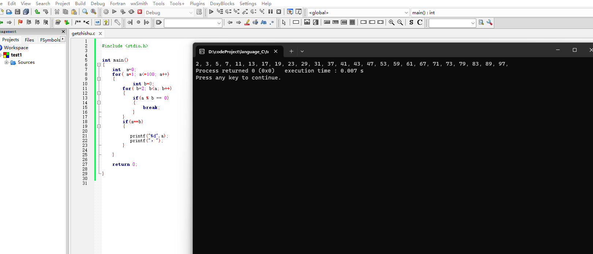

# 练习循环和分支

## 1.求1至100之和

```c
int main()
{
    int  x;
    for(int a=0; a<=100; a++)
    {
        x+=a;
    }

    return 0;
}
```

## 2.找出100以内的所有质数




## 3.使用筛子找出100以内的质数

```c
#include <stdio.h>
static int MAX_NUM = 101;

int main()
{
    int b=2; // 最小的质数, 遍历开始
    int nums[MAX_NUM];
    for(int j=0;j<MAX_NUM;j++)
    {
        nums[j] = 1;  //数组初始化为1,状态位
    }

    nums[0]=nums[1]=0;  // 0,1既不是质数也不是合数
    while(b * b < MAX_NUM)
    {
        if(nums[b] == 1){//查看当前数字(下标)是否是质数, 如果是质数,开始把它的倍数的状态位都设置为0, 表示合数.
            for(int i=2;i*b<MAX_NUM;i++)
            {
                nums[b*i]=0;
            }
        }
        b+=1;  //寻找下一个质数.
    }

    for(int j=0;j<MAX_NUM;j++)
    {
        if(nums[j] == 1){  // 剩下这些状态位为1的就是筛子留下的质数了.
            printf("%d ", j);
        }
    }
    return 0;

}

```


## 4.补充

问：最后不写return 0;有影响吗？

答：最好带上 return 语句. 一般c语言, linux内核返回0代表程序正常执行返回, 返回非0代表出问题了.


