# dbeaver

## 安装

https://dbeaver.io/download/  


按照如下步骤安装并配置即可.
1. 下载dbeaver社区版本.
	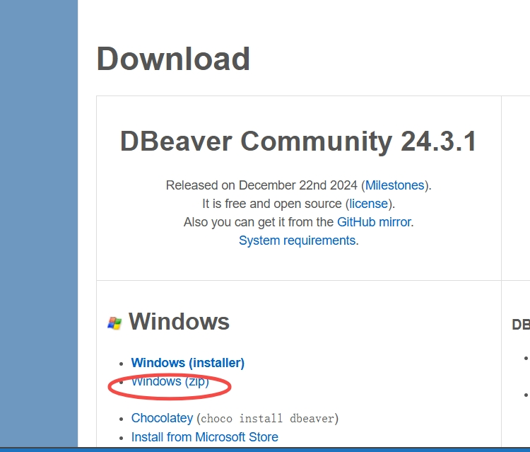


2. 解压缩文件，打开可执行文件.
	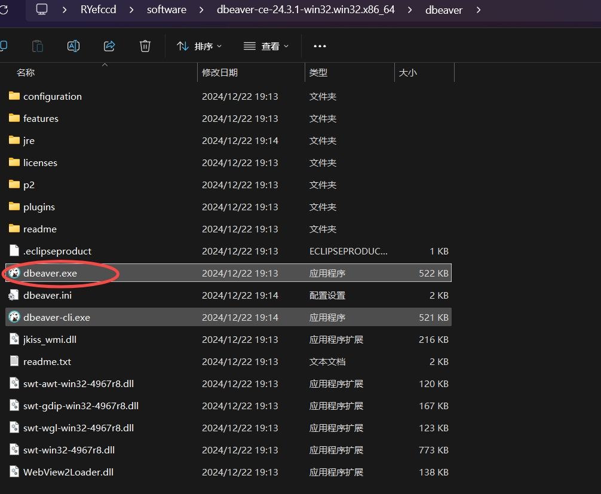

3. 新建数据库连接.
	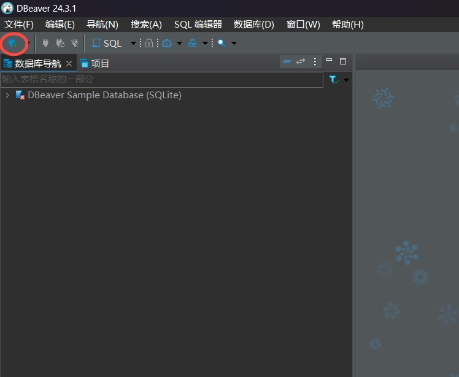


4. 选择 duckdb.

	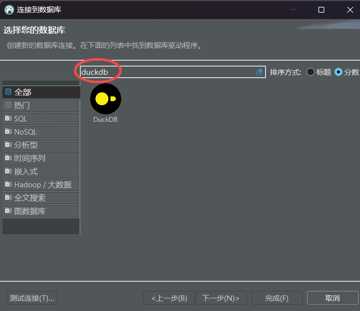

	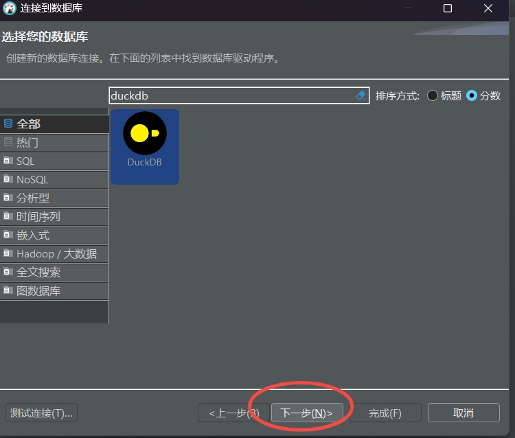


5. 填写连接名字

	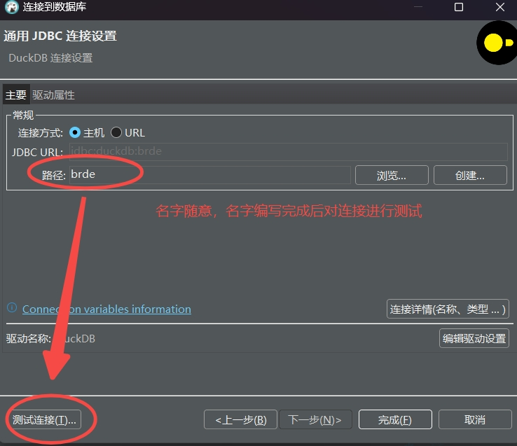


6. 编辑驱动

	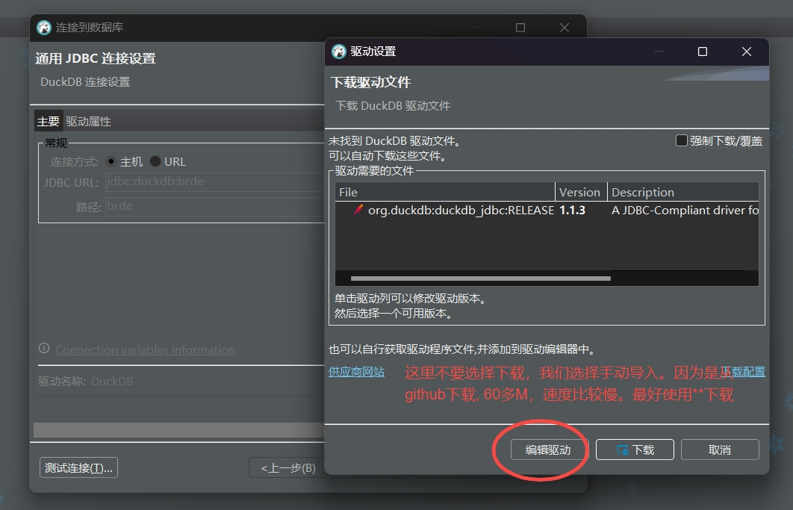

	删除原来的默认配置(这些配置需要下载, 如果下载慢, 就删除这些默认配置手动导入 duckdb 的 jar 包即可)

	

	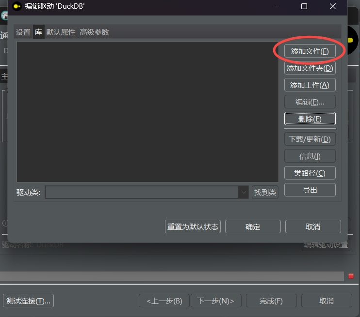


	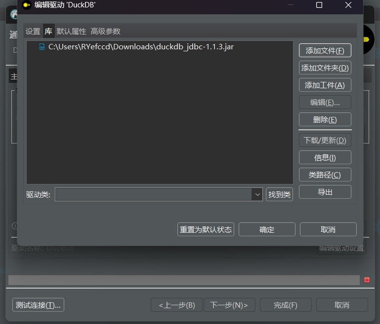

https://duckdb.org/docs/installation/?version=stable&environment=java&download_method=direct
或者在brde中的梯队建设共享目录中去下载 [duckdb_jdbc-1.1.3.jar](https://geetest1024.feishu.cn/file/NPAybkZT8oZcpBxeoZvcRkgIn7g)


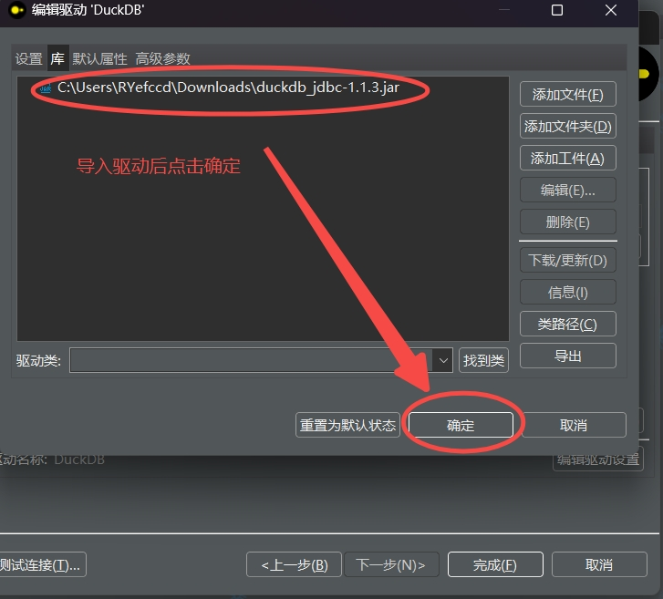

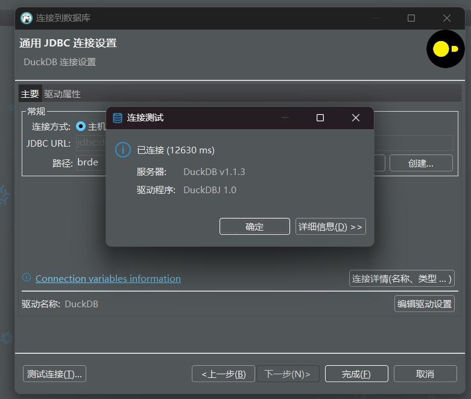


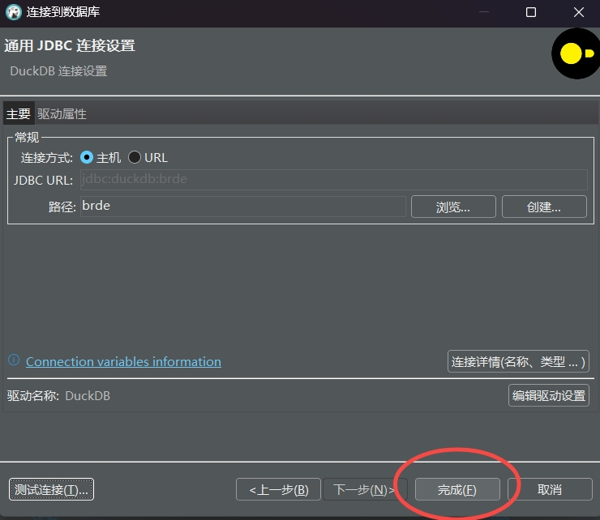


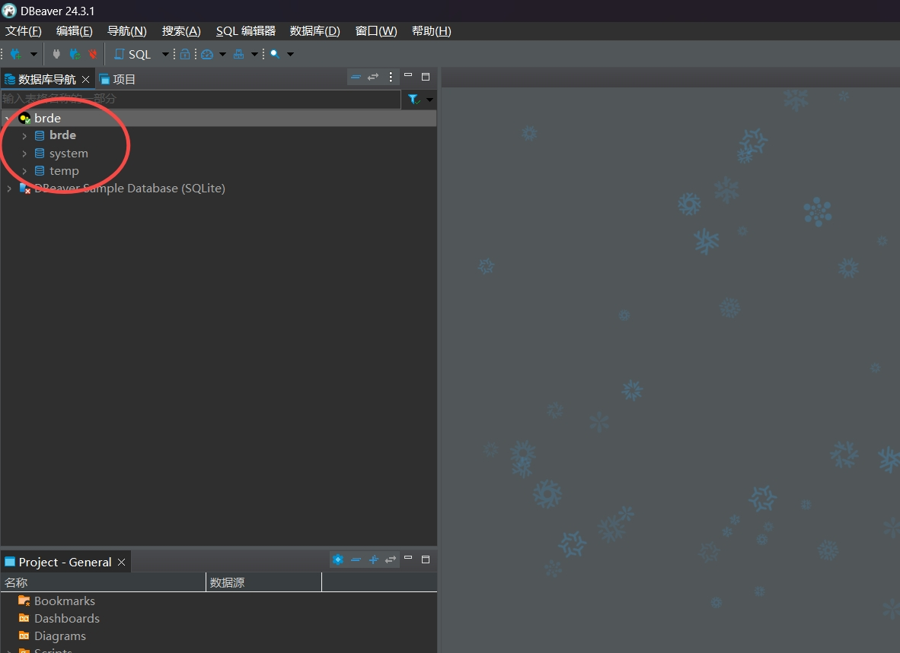


配置完成后，运行sql


```sql
select * from duckdb_databases();
SELECT * FROM duckdb_secrets();
SELECT * FROM duckdb_settings();
```


# sql-studio
