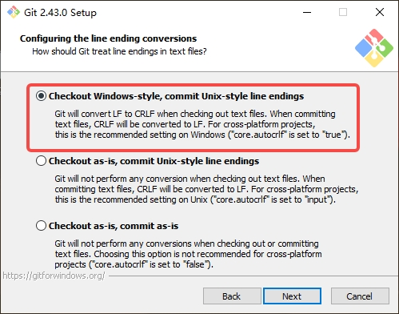
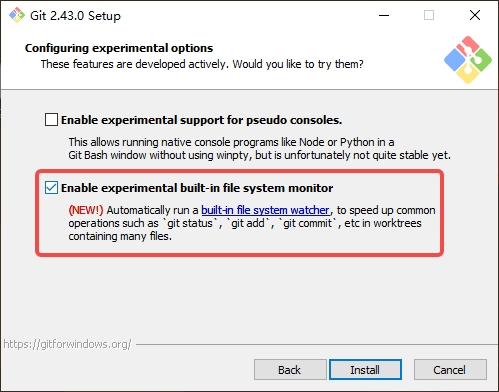
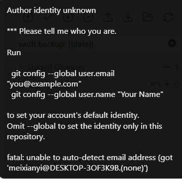

## 技巧汇总

### 安装
#### 1 安装代理可以访问插件

```shell
  # 配置代理，可以访问第三方插件社区市场
 --proxy-server=http://192.168.1.201:1080

   # 右点击属性，在后面添加配置
```


   note：
	 插件可以丰富写文档的各种素材和便捷。还可以安装git插件。在线提交文档代码到github，
	 windows下安装git如下文
	 


#### 1 windows 安装git.exe

```
  # 下载地址
  https://gitforwindows.org/
```

#### 2 安装注意事项，一般选默认,有几个注意一下







#### 3 windows下的git修改配置。


- 避免windows提醒文件的换行符. 这个只在windows系统上设置, 不能跨平台设置. 
	```
	# 双击桌面图标 打开git 
	git config --global core.autocrlf false
	```


- 设置git 的账号信息, 才能使用 obsidian-git 插件来进行提交(**不在obsidian里提交代码忽略此条**)

	


- github有时候需要梯子，提交代码和拉取 

```shell
# 测试一下网络是否连通
   # ssh -T git@github.com   (待测)

# 设置代理
git config --global http.proxy http://192.168.1.201:1080/
# git config --global http.proxy socks5://localhost:7890/

# 移除代理
git config --global --unset-all http.proxy
```

- git config --list  可以查看所有的配置，包括username,proxy

```
git config -l

diff.astextplain.textconv=astextplain
filter.lfs.clean=git-lfs clean -- %f
filter.lfs.smudge=git-lfs smudge -- %f
filter.lfs.process=git-lfs filter-process
filter.lfs.required=true
http.sslbackend=openssl
http.sslcainfo=C:/Program Files/Git/mingw64/etc/ssl/certs/ca-bundle.crt
core.autocrlf=true
core.fscache=true
core.symlinks=false
core.fsmonitor=true
pull.rebase=false
credential.helper=manager
credential.https://dev.azure.com.usehttppath=true
init.defaultbranch=main
core.autocrlf=false
user.email=13296660374@163.com
user.name=mxy
http.proxy=socks5://localhost:7890/
core.repositoryformatversion=0
core.filemode=false
core.bare=false
core.logallrefupdates=true
core.symlinks=false
core.ignorecase=true
remote.sshorigin.url=git@github.com:republicroad/republic.git
remote.sshorigin.fetch=+refs/heads/*:refs/remotes/sshorigin/*
branch.main.remote=sshorigin
branch.main.merge=refs/heads/main
gui.wmstate=normal
gui.geometry=1061x563+160+160 233 255
remote.origin.url=https://github.com/republicroad/republic.git
remote.origin.fetch=+refs/heads/*:refs/remotes/origin/*

```


### 编辑技巧

#### 图片引用

图片使用相对当前文档的单独目录

obsidian 默认粘贴图片使用的是 wiki 链接, 使用如\[[文件名]]和 \!\[[图片名]] 表示. 可以在**设置**-->**文件与链接** 中的**使用 wiki 链接**关闭即可. 如下图所示:


这样可以保证 github 预览中可以渲染出图片.


#### 文档引用


相对当前目录
	[vscode](vscode.md)
	
相对当前仓库根目录
	[vscode](vscode.md)
	
尽可能简短的模式
	[vscode](vscode.md)


## 资料链接

[obsidian 插件](https://mdnice.com/writing/5caac9e9eb61489a959db5fd415e4d20)

[手动安装插件](https://www.youtube.com/watch?v=ffGfVBLDI_0)

[git_windows_crlf](https://stackoverflow.com/questions/17628305/windows-git-warning-lf-will-be-replaced-by-crlf-is-that-warning-tail-backwar)

[obsidian_plugin_template](https://github.com/polyipseity/obsidian-plugin-template)

