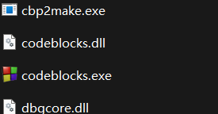
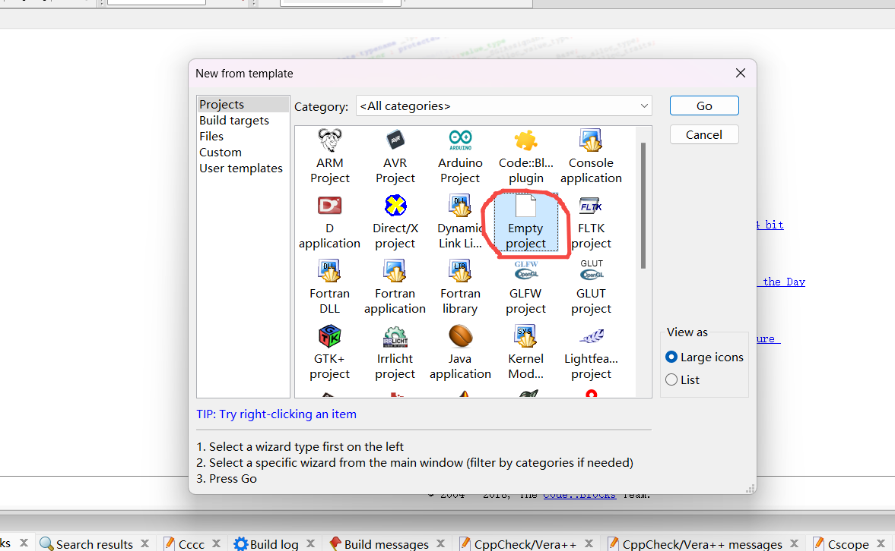
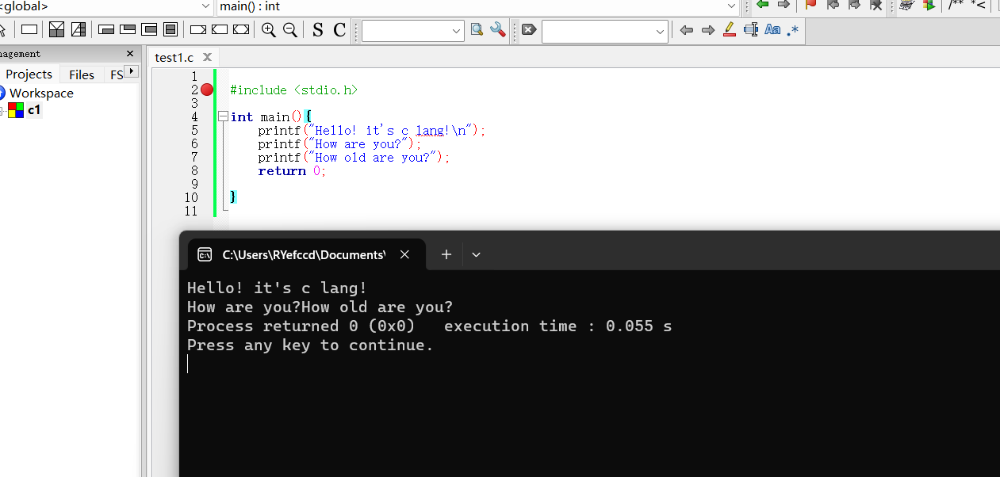

# 安装环境

## 1.【下载】codeblocks-20.03minggw-nosetup.zip

解压至某个文件夹，然后点击codeblocks.exe

先不关联任何c文件
	
打开后默认包含了GNU GCC Compiler 编译器，选择ok

## 2.【创建项目】

  create a new project

  选择空项目 Empty project
	
  填写项目名称, 选择项目目录
	
  设置编译 debug(调试) 和 release(发布)
  
  
## 3.【创建文件】
 创建空文件 -- 选择左上角的创建空白文件图标Empty file
  
 文件名以 .c 结尾
    
 输入测试代码
 
 代码开始
	\#include <stdio.h>

	int main(){
		printf("Hello! it's c lang!\n");
		printf("How are you?");
		printf("How old are you?");
		return 0;

	}

代码结束

 

## 3.运行

点击运行按钮，查看运行结果

